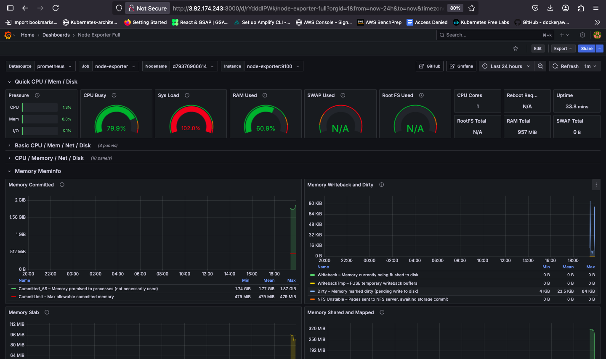

# EC2 Monitoring with Grafana & Prometheus

Complete monitoring solution for EC2 instances with real-time dashboards and alerting.

## 📊 Dashboard Preview


*Real-time monitoring dashboard showing CPU, memory, disk, and network metrics*

## 🚀 Quick Setup

### 1. Configure EC2 Security Groups

Enable these ports in your EC2 security group:
- **Port 3000** - Grafana Dashboard
- **Port 9090** - Prometheus Metrics
- **Port 9100** - Node Exporter

### 2. Install Monitoring Stack

```bash
git clone https://github.com/Junnygram/ec2-monitor.git
cd ec2-monitor
chmod +x install.sh
./install.sh
```

### 3. Access Services

- **Grafana**: `http://YOUR_EC2_PUBLIC_IP:3000`
- **Prometheus**: `http://YOUR_EC2_PUBLIC_IP:9090`
- **Node Exporter**: `http://YOUR_EC2_PUBLIC_IP:9100`

## 📈 Grafana Dashboard Setup

### Step 1: Login to Grafana
1. Open `http://YOUR_EC2_PUBLIC_IP:3000`
2. **Username**: `admin`
3. **Password**: `4fsd#dad2e`

### Step 2: Add Prometheus Data Source
1. Click **"Add your first data source"**
2. Select **"Prometheus"**
3. Set URL: `http://YOUR_EC2_PUBLIC_IP:9090`
4. Click **"Save & Test"**

### Step 3: Import Node Exporter Dashboard
1. Click **"+"** → **"Import"**
2. Enter Dashboard ID: **`1860`**
3. Click **"Load"**
4. Select your Prometheus data source
5. Click **"Import"**

### Step 4: Visualize Your Metrics
Your dashboard will show:
- 🖥️ CPU Usage & Load
- 💾 Memory Utilization
- 💿 Disk I/O & Space
- 🌐 Network Traffic
- ⚡ System Uptime

## 🧪 Testing Your Setup

Test monitoring with included scripts:

```bash
# Create CPU spike
./cpu_spike.sh

# Create memory spike
./memory_spike.sh
```

Watch the spikes appear in your Grafana dashboard!

## 🛠️ What's Included

- 🔍 **Prometheus** - Metrics collection and storage
- 📊 **Grafana** - Beautiful visualization dashboards
- 📈 **Node Exporter** - System metrics exporter
- 🐳 **Docker Compose** - Container orchestration
- 🧪 **Load Testing** - CPU/Memory spike scripts

## 📋 Requirements

- Ubuntu EC2 instance (t2.micro or larger)
- Security groups configured for ports 3000, 9090, 9100
- SSH access to your server

## 🔧 Troubleshooting

**Services not accessible?**
```bash
# Check if containers are running
docker ps

# View logs
docker-compose logs

# Restart services
docker-compose restart
```

**Dashboard not loading data?**
- Verify Prometheus URL in data source
- Check if all ports are open in security groups
- Ensure EC2 public IP is correct

## 🎯 Next Steps

- Set up alerting rules in Prometheus
- Configure email notifications
- Add custom dashboards for your applications
- Implement log monitoring with ELK stack